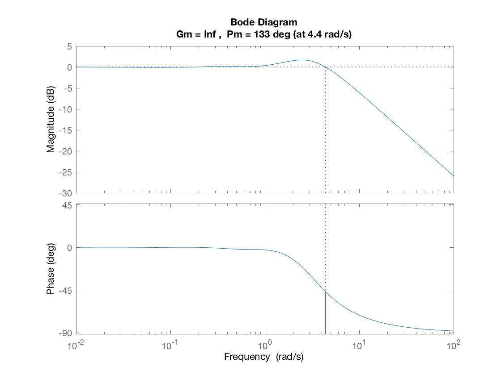
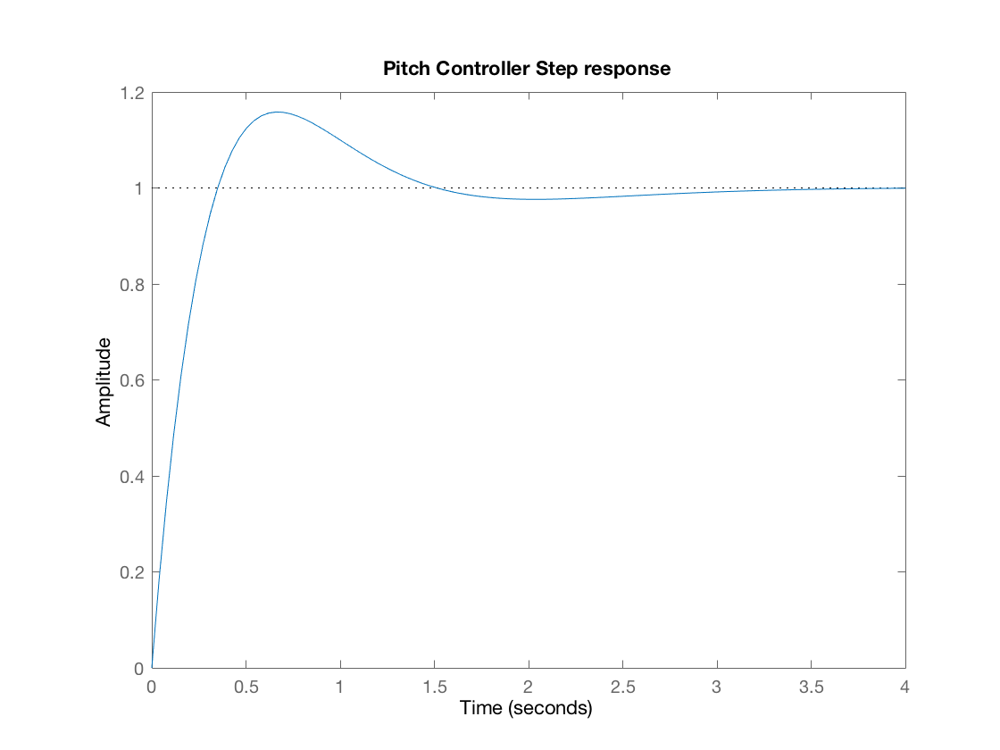
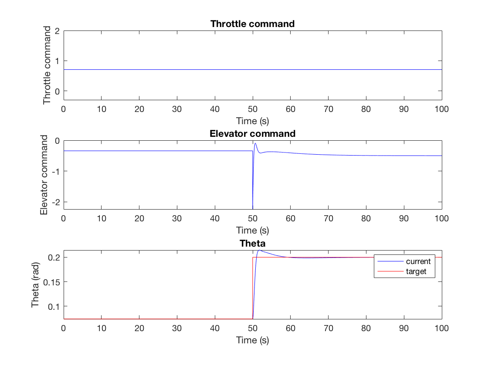
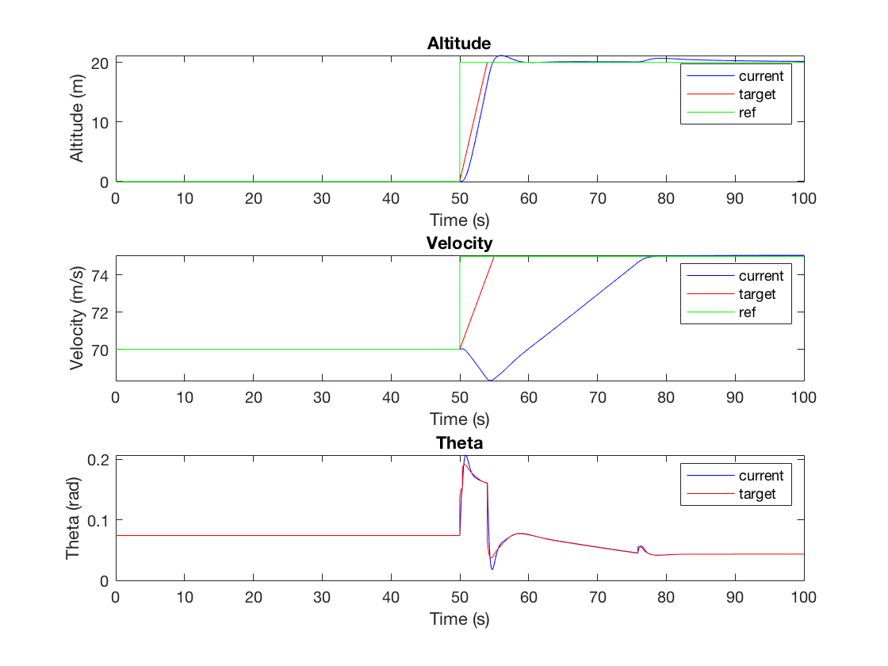

# Aircraft Longitudinal Motion

## Parameters

Parameters are defined in the `params.m` matlab file.

Aircraft parameters:

- Thrust Max = 150000 N
- Mass = 150\*10^3 kg
- S = 360 m^2
- c = 7.5m no unit
- Cl(0)=0.9 no unit
- Cl(alpha) = 5.5/rad
- Cd(0) = 0.065
- Cd(alpha) = 0.4/rad
- Cm(0)=-0.3 no unit
- Cm(alpha) = -1.5/rad
- Cm(delta) = -1.2/rad
- IYY = 1.6\*10^7 kg/m2

## Trim for steady flight at constant altitude

Run `find_trim_steady_level_flight.m` matlab function

For V_a = 70 m/s:

- alpha_trim = 0.0740 rad
- d_th_trim = 0.7075 no unit (scaling factor of Thrust Max)
- d_elev_trim = -0.3425 rad

## Linearized longitudinal dynamical system

Run `linear_systen.m` matlab script

The system is linearized around the trim position defined above.

### Stability

State: [u;w;q;theta]:

Eigenvalues:

- -0.3135 + 0.8186i  *Short Period mode*
- -0.3135 - 0.8186i *Short Period mode*
- 0.0027 + 0.1997i *Phugoid mode*
- 0.0027 - 0.1997i *Phugoid mode*

**Phugoid mode is unstable since: Re(0.0027 - 0.1997i) > 0**

### Elevator to Pitch Input-Output system

- Laplace transform of the elevator to pitch system linearized around trim position
- PID controller
    - Kp_theta = -15;
    - Kd_theta = -8;
    - Ki_theta = -5;

**Frequency response of Pitch PID controller (linearized system):**

**Step response of Pitch PID controller (linearized system):**

## Control

### Picth controller

**Picth step response on real system:**

**Limitation:** There is no saturation on the elevator, this should be added and taken into account in the controller

### Altitude and Speed controller: Total Energy Control System

Ref: *Total Energy Control for LongitudinalAutopilot - Randal W. Beard* (http://uavbook.byu.edu/lib/exe/fetch.php?media=shared:tecs_autopilot.pdf)

**Mechanism:**

- Throttle: Act on the total energy of the system
- Pitch: Act on the balance of the energy between Potential energy and Kinetic energy

**Controller**

- PI: On the Total Energy -> Throttle command
- PID: On the Energy Balance -> Pitch command

**Notes:**

- Need to add a weight on the balance between kinetic and potential energy to priorize potential energy otherwise the aircraft would dive to achieve desired speed
- Need to add saturation on the Potential and Kinetic energy error otherwise kinetic energy error overweight potential energy error

**Altitude and Speed changes:**

**Altitude and Speed changes:**

## Limitations

Some limitations:

- There is no limit on the elevator actuator
- Need to add proper saturations to the different controller based on actuators limitations
- Re-tune controller properly with actuators limitations
- Could improve the model by recomputing the trim values and feed them as feed-forward when changing mode (climbing, different speed, etc)
